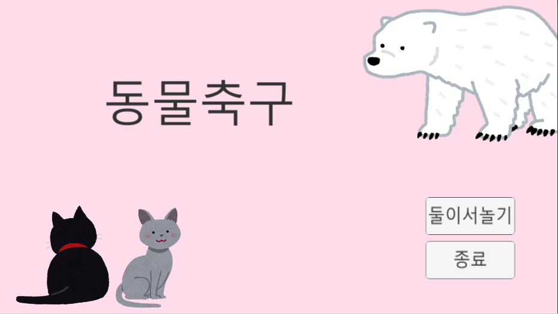
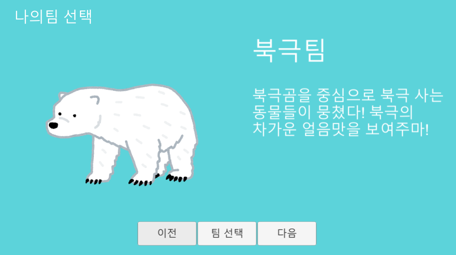
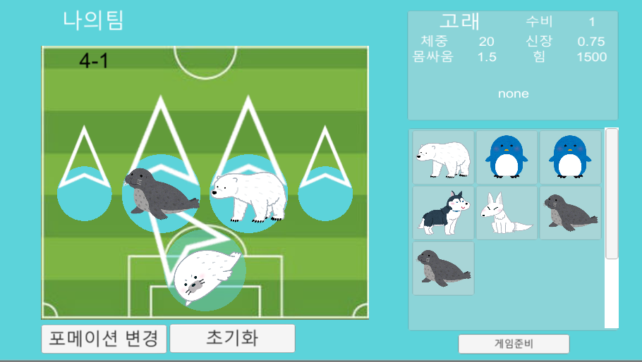
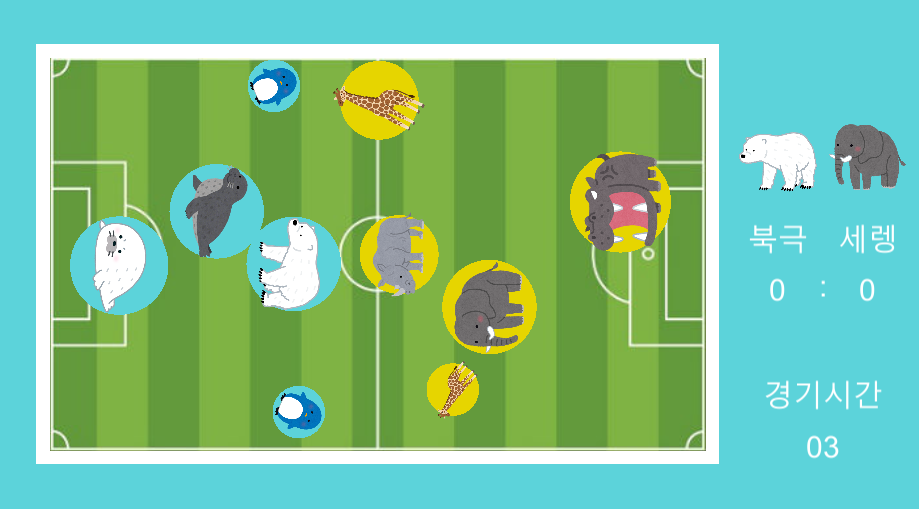
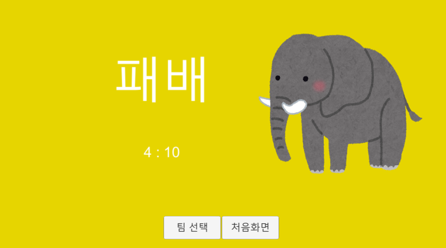

# 동물 축구
## 게임 개요

간단한 터치를 이용한 턴제 전략 캐주얼 게임입니다.
단순히 자신의 동물들을 이동시켜 상대방 영역 끝에 도달할수록 점수를 얻는 게임입니다.

플랫폼 : 안드로이드
제작인원 : 1명
제작자 : 이식
제작기간 : 3주(제작중)

## 사용 도구
개발툴 : unity 2.17, Visual Studio 2019

사용 언어 : c#

일러스트:
- www.irasutoya.com

기타 참고:
-

## 게임 방법
1. 자신의 동물을 배치한다.
  - 동물에 따라 특성과 스킬이 다르니 신중하게 배치

2. 동물들이 배치에 따라 이동한다.

3. 각자의 점수를 정산

4. 전 라운드를 참고로 다시 동물을 배치한다. (1번 과정으로 반복)

5. 6라운드 경과 후 점수를 비교해 승패를 가림

## 소스코드 설명 및 주요 기능
- GameManagerScript.cs : 게임 데이터를 관리 코드
  - 데이터 저장 및 로드
  - 팀 데이터, 선수 데이터 클래스
- GameStartManager : 게임 초기화면 씬을 관리
  - GameStartManager.cs : 게임 초기화면 씬을 관리 코드
- TeamSelect : 게임 팀 선택 씬을 관리
  - TeamSelectManager.cs : 게임 팀 선택 씬을 관리 코드
    - 게임 플레이모드 선택 함수
    - 게임 종료
- TeamSettingManager : 게임 팀 관리 씬을 관리
  - InventorySlot.cs : 인벤토리 관리 코드
    - 인벤토리 업데이트
    - 인벤토리 선수 추가
  - PlayerSetting.cs : 전술화면 관리 코드
    - 필드 업데이트
    - 필드 선수 추가
    - 필드 플레이어 초기화 함수
  - TeamSettingManager.cs : 게임 팀 관리 코드
    - 필드 포메이션 설정
    - 포메이션 변경
    - 필드 플레이어 초기화
    - 게임 플레이 씬 전환
    - 필드 포메이션 구조체
- MainGame : 게임 플레이 씬을 관리
  - PlayScript.cs : 전체 게임을 관리 코드
    - 게임 엔딩 씬 전환
  - RoundScript.cs : 게임 플레이 관리(라운드) 코드
    - 팀 설정 로드
    - 게임 UI 출력
  - UnitScript.cs : 게임 유닛 관리 코드
    - 유닛 움직임 관리
    - 유닛 스킬 구현
    - 유닛 충돌 관리
- Endding : 게임 엔딩 씬을 관리
  - EnddingScript.cs : 게임 엔딩 씬 관리 코드
    - 게임 결과 출력
    - 팀 선택 씬 전환
    - 게임 초기화면 씬 전환

## 시연화면
- 게임 시작 화면

  

- 게임 플레이 화면

  

  

  

- 게임 결과 화면

  

## 첨부자료

- 게임 데모 플레이 영상(동영상시연.mp4)
- 소스코드 (소스코드(folder))
